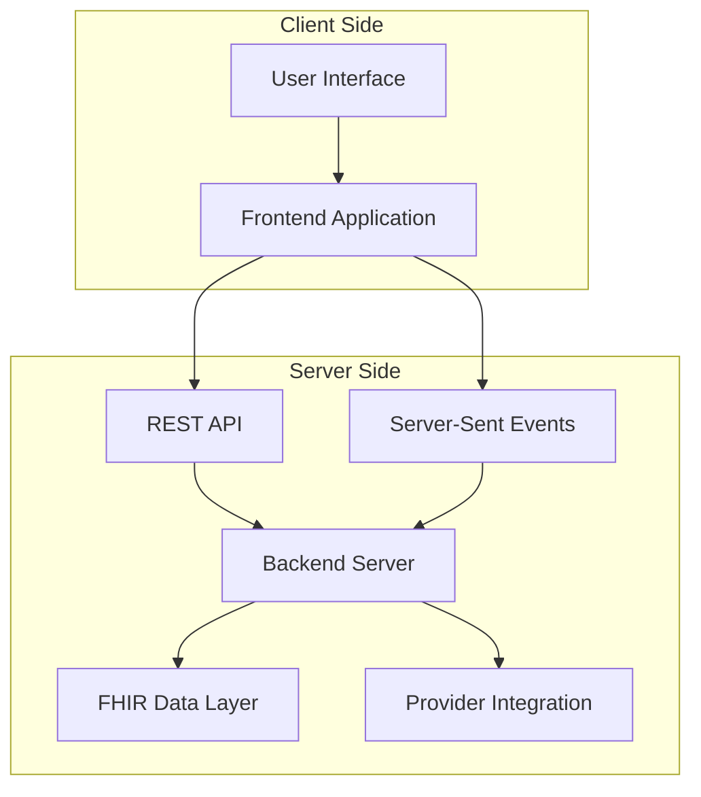

# System Architecture

## Overview
The WEX FSA Provider Substantiation Demo is a lightweight, event-driven system demonstrating zero-touch healthcare claim verification through provider integration.

## High-Level Architecture



## Component Architecture

### 1. Frontend Application
**Technology**: Vanilla HTML, CSS, JavaScript (ES6+)
**Location**: `wex-fsa-provider-substantiation-frontend/index.html`

#### Key Components
- **UI Layer**: Modern, responsive interface
- **State Management**: JavaScript-based application state
- **Event Handling**: User interactions and real-time updates
- **API Client**: Fetch-based HTTP client
- **EventSource Client**: Server-Sent Events subscription

#### Data Flow
```javascript
User Action → Event Handler → API Call → UI Update
                ↓
Real-time Events → EventSource → State Update → UI Refresh
```

### 2. Backend API Server
**Technology**: Python 3.9+ with Flask 2.3.3
**Location**: `wex-fsa-provider-substantiation-backend/src/server.py`

#### Key Components
- **HTTP Server**: Flask-based REST API
- **CORS Handler**: Cross-origin resource sharing
- **Mock Data Layer**: Simulated healthcare data
- **Event Streaming**: Server-Sent Events implementation
- **FHIR Processor**: ExplanationOfBenefit generation

#### API Endpoints
```
GET  /health                     → Health check
POST /link-account              → Provider authentication
GET  /transaction-status/{id}   → Transaction with FHIR data
GET  /events                    → Server-Sent Events stream
```

## Data Architecture

### State Management
```python
# Backend state store
mock_state = {
    'link_status': 'idle|linking|linked',
    'transactions': [],
    'current_user': None
}
```

### FHIR Data Structure
```json
{
  "transaction": {
    "id": "TX-001",
    "provider": "Downtown Dental Associates",
    "status": "Pending|Approved",
    "eob": {
      "resourceType": "ExplanationOfBenefit",
      "type": "Dental",
      "patient": "Patient reference",
      "item": ["Service details"],
      "total": ["Financial totals"]
    }
  }
}
```

## Communication Patterns

### 1. Request-Response (REST)
```
Frontend ←→ Backend
   │           │
   └── HTTP ───┘
```

**Use Cases**:
- Initial data loading
- User-initiated actions
- Status queries

### 2. Event Streaming (SSE)
```
Frontend ←─── Backend
   │           │
   └── Events ─┘
```

**Use Cases**:
- Real-time transaction updates
- Status change notifications
- Live data synchronization

## Security Architecture

### Current Security Model
⚠️ **Demo Environment - No Production Security**

```
Browser ←── HTTP ──→ Server
   │     (No Auth)      │
   └── CORS: "*" ───────┘
```

### Production Security Model
```
Browser ←── HTTPS/TLS ──→ Load Balancer ←──→ App Server
   │                            │               │
   └── OAuth2/JWT ──────────────┘               │
                                                │
                                          ┌─────┴─────┐
                                          │  Security │
                                          │   Layer   │
                                          │ • Auth    │
                                          │ • Logging │
                                          │ • Firewall│
                                          └───────────┘
```

## Deployment Architecture

### Current Development Setup
```
localhost:3000  ←─── User
       │
   [Frontend]
       │
   HTTP Calls
       │
localhost:4000
   [Backend]
       │
  Mock Provider
```

### Production Architecture
```
Internet ←── CDN ←── Load Balancer ←── App Servers
                         │               │
                    Health Checks    ┌─────────┐
                         │          │Backend  │
                    ┌────────────────│Cluster  │
                    │                │(N nodes)│
                    │                └─────────┘
                    ▼                     │
               Monitoring              Database
                  │                      │
              ┌────────────┐         ┌─────────┐
              │ Logging    │         │ FHIR    │
              │ Metrics    │         │ Storage │
              │ Alerting   │         └─────────┘
              └────────────┘
```

## Technology Stack

### Frontend Stack
```yaml
Core: HTML5, CSS3, JavaScript (ES6+)
Styling: CSS Grid, Flexbox, Custom Properties
Networking: Fetch API, EventSource API
Compatibility: Modern browsers (Chrome 90+, Firefox 88+, Safari 14+)
```

### Backend Stack
```yaml
Runtime: Python 3.9+
Framework: Flask 2.3.3
CORS: Flask-CORS 4.0.0
Data: JSON (mock), Future: PostgreSQL/MongoDB
Protocols: HTTP/1.1, Server-Sent Events
```

### Development Stack
```yaml
Version Control: Git
Documentation: Markdown
Process Management: Shell scripts
Testing: Manual (current), Future: pytest + Selenium
```

## Scalability Considerations

### Current Limitations
- **Single-threaded**: Flask development server
- **In-memory state**: No persistence across restarts
- **No load balancing**: Single server instance
- **Synchronous processing**: No async/await patterns

### Scaling Strategy

#### Phase 1: Basic Production (1-100 users)
```python
# WSGI server
gunicorn --workers 4 --bind 0.0.0.0:4000 src.server:app

# Add Redis for session state
redis_client = redis.Redis(host='redis-server')

# Basic monitoring
import logging
logging.basicConfig(level=logging.INFO)
```

#### Phase 2: Enhanced Scale (100-1K users)
- **Database**: PostgreSQL with connection pooling
- **Cache**: Redis for session/transaction cache
- **Load Balancer**: nginx or cloud load balancer
- **Monitoring**: ELK stack or cloud monitoring

#### Phase 3: High Scale (1K+ users)
- **Microservices**: Separate authentication, FHIR, notifications
- **Container Orchestration**: Kubernetes or Docker Swarm
- **Message Queue**: RabbitMQ or cloud messaging
- **Auto-scaling**: Based on CPU/memory metrics

## Performance Characteristics

### Current Performance
```
Endpoints:
- /health: ~10ms response time
- /link-account: 2000ms (intentional delay)
- /transaction-status: ~50ms response time
- /events: ~3000ms to first event

Throughput:
- Concurrent connections: Limited by dev server
- Memory usage: ~50MB per process
- CPU usage: Minimal (mostly I/O wait)
```

### Performance Targets
```
Production Targets:
- API Response time: <200ms (95th percentile)
- Event delivery: <100ms after trigger
- Concurrent users: 1000+ per server
- Uptime: 99.9%
```

## Integration Points

### Current Integrations
- **Mock Provider**: Simulated Epic FHIR integration
- **Local Storage**: Browser-based session persistence
- **Static Assets**: Direct file serving

### Future Integration Points

#### Epic FHIR Integration
```python
# OAuth2 authentication flow
epic_client = EpicFHIRClient(
    client_id='your-client-id',
    base_url='https://fhir.epic.com/interconnect-fhir-oauth'
)

# Token exchange and API calls
token = epic_client.get_access_token(auth_code)
eob = epic_client.get_explanation_of_benefit(patient_id, token)
```

#### Payment Processing
```python
# Integration with payment providers
payment_client = PaymentClient(
    provider='stripe',  # or other processor
    api_key='your-api-key'
)

# Process FSA payment
payment_result = payment_client.process_fsa_payment(
    amount=transaction['patientResponsibility'],
    account=user['fsa_account']
)
```

## Monitoring and Observability

### Current Monitoring
- **Console Logs**: Basic request/response logging
- **Browser DevTools**: Client-side debugging
- **Manual Testing**: End-to-end verification

### Production Monitoring

#### Application Metrics
```python
# Custom metrics
from prometheus_client import Counter, Histogram

REQUEST_COUNT = Counter('http_requests_total', 'Total HTTP requests')
REQUEST_DURATION = Histogram('http_request_duration_seconds', 'HTTP request duration')

@app.before_request
def before_request():
    REQUEST_COUNT.inc()
    g.start_time = time.time()

@app.after_request
def after_request(response):
    REQUEST_DURATION.observe(time.time() - g.start_time)
    return response
```

#### Health Monitoring
```yaml
Health Checks:
- Endpoint availability: GET /health every 30s
- Database connectivity: Connection pool status
- External services: FHIR provider status
- Resource usage: CPU, memory, disk

Alerts:
- Response time > 1s: Warning
- Response time > 5s: Critical  
- Error rate > 5%: Warning
- Error rate > 10%: Critical
```

---

*For implementation details, see the [Developer Guide](01-DEVELOPER_GUIDE.md) and [API Reference](02-API_REFERENCE.md).*